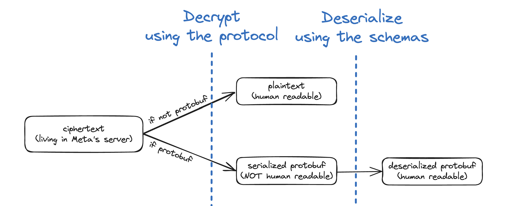

# Messaging Schemas &middot; Deserializing Protobufs

This repo contains the Protocol Buffer schemas used for Meta's end-to-end encryption (E2EE) backend storage: Encrypted Backups (EB). The encrypted data stored in EB can be of one of the two types: encrypted human readable plaintext (old format) or encrypted serialized protobufs (new format). 

Once data is decrypted using [Meta's Labyrinth protocol](https://engineering.fb.com/wp-content/uploads/2023/12/TheLabyrinthEncryptedMessageStorageProtocol_12-6-2023.pdf), the plaintext (old format) is human readable, whereas the serialized protobuf (new format) is not. So there is additional deserialization required for reading the new format. The schemas in this repo can be used for that deserialization.



### How to use the enclosed files

There are 9 files in total: 8 `.proto` files and 1 `.json` file.

* The eight `.proto` files outline all protobuf schemas used for Meta's Encrypted Backup (EB). 
* The one `subprotocols.json` file outlines the mapping from `SubProtocol` types to the actual type used. The `"message"` + `"field"` values map to the `"deserialized_message"` type. If the `"deserialized_message"` is not available on the entry, it means that the field is not further deserializable.

```
facebook/messaging_schemas/
├── README.md
├── armadillo_application.proto
├── armadillo_xma.proto
├── backup_message.proto
├── common.proto
├── consumer_application.proto
├── media_transport.proto
├── msg_application.proto
├── transport_events.proto
└── subprotocols.json
```

### License

This repo ([facebook/messaging_schemas](https://github.com/facebook/messaging_schemas)) is licensed under the BSD 3-Clause License found in the LICENSE file in the root directory of this source tree.